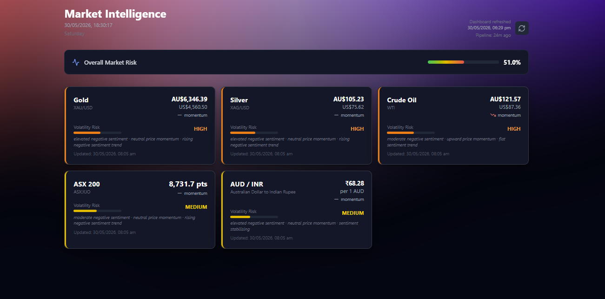

# Market Intelligence System

> Multi-agent financial news intelligence for commodity and equity risk analysis.

[Live Dashboard](https://market-intelligence-system-app.vercel.app)

[API](https://market-intelligence-system-tau.vercel.app)



---

## What It Does

Financial market volatility is driven by prices **and** narratives. This system tracks both.

- Scrapes 10+ financial news sources every 15 minutes via specialised agents
- Runs **FinBERT** sentiment analysis with a two-layer relevance filter (keyword + semantic)
- Combines sentiment signals with price momentum to produce asset-specific volatility risk scores
- Generates 5-day price forecasts using linear regression with validated sentiment lag features
- Delivers everything through a live React dashboard with AI-generated plain English analysis

**Target use case:** Banking risk teams, commodity trading desks, FX transfer timing.

---

## Assets Tracked

| Asset | Ticker | Sources |
|---|---|---|
| Gold | GC=F | Kitco, CNBC, BBC, FT, MarketWatch, RBA |
| Silver | SI=F | Kitco, CNBC, BBC, FT, MarketWatch |
| Crude Oil | CL=F | OilPrice.com, CNBC, BBC, FT, MarketWatch |
| ASX 200 | ^AXJO | RBA, CNBC, BBC, FT, MarketWatch |
| AUD/INR | AUDINR=X | ForexLive, FXStreet, Economic Times, Business Standard, Mint, Hindustan Times |

---

## Architecture
```
NEWS SOURCES          SPECIALIST AGENTS        PIPELINE
────────────          ─────────────────        ──────────────────────
OilPrice.com     →    Oil Agent           →
Kitco            →    Commodities Agent   →    Two-Layer Relevance Filter
CNBC / BBC       →    News Agent          →    (Keyword 40% + Semantic 60%)
RBA              →    Banking Agent       →
FT / MarketWatch →    Macro Agent         →    FinBERT Sentiment Analysis
ET / FXStreet    →    India/FX Agent      →
→    Volatility Aggregator
Yahoo Finance    →    Price Agent         →    (Sentiment 40% + Momentum 35% + Trend 25%)
↓
Supabase PostgreSQL
↓
FastAPI (Vercel)
↓
React + Tailwind Dashboard
```

---

## Tech Stack

| Layer | Technology | Reason |
|---|---|---|
| Sentiment | FinBERT | Trained on financial text — outperforms generic NLP on market language |
| Relevance | sentence-transformers (all-MiniLM-L6-v2) | Catches cross-asset signals keywords miss |
| Predictions | Linear Regression | Explainability — banking requires auditable model decisions |
| Database | Supabase (PostgreSQL) | Free forever, no expiry unlike Render |
| Backend | FastAPI (main_lite.py) | Vercel Lambda 500MB limit — ML models run in GitHub Actions only |
| Frontend | React + Tailwind + Recharts | — |
| Scheduler | GitHub Actions (cron every 15 min) | Free forever, no infrastructure to maintain |
| AI Analysis | Groq (llama-3.3-70b-versatile) | Sub-second inference for live dashboard analysis |

---

## Key Technical Decisions

**Why FinBERT over VADER or TextBlob?**
Generic sentiment models misclassify financial language. "The company beat earnings" scores neutral on VADER — FinBERT correctly identifies it as positive.

**Why a two-layer relevance filter?**
Keywords catch hard zeros (completely irrelevant headlines). Semantic similarity catches nuanced cross-asset signals — "Hormuz blockade" triggers gold relevance via safe-haven reasoning even without the word "gold". Neither layer alone is sufficient.

**Why linear regression for predictions?**
In banking, model decisions need to be auditable. A linear model's coefficients directly show which features drive the forecast. This is a regulatory consideration, not just a technical preference.

**Why sentiment lag validation before using sentiment as a prediction feature?**
The lag analysis component accumulates sentiment-to-price correlation data per asset. Sentiment only feeds price predictions once the lag is empirically validated — adding weak signals to a high R² model risks overfitting on limited data.

---

## Prediction Model — R² Scores

| Asset | R² | Sentiment Lag Used |
|---|---|---|
| Gold | 0.93 | 4-day lag |
| Silver | 0.89 | 4-day lag |
| Crude Oil | 0.97 | 2-day lag |
| ASX 200 | 0.82 | 1-day lag |
| AUD/INR | 0.97 | Same-day (0-day lag) |

---

## Volatility Scoring

Three signals combined per asset each pipeline run:

| Signal | Weight | Calculation |
|---|---|---|
| Sentiment score | 40% | Negative headline % from last 24 hours |
| Price momentum | 35% | (avg last 5 days − avg first 5 days) / avg first 5 days |
| Sentiment trend | 25% | Is negativity increasing over last 7 days? |

Risk levels: LOW (0–35%) · MEDIUM (35–50%) · HIGH (50–65%) · CRITICAL (65%+)

---

## Zero Cost Stack

Every component runs permanently for free — no expiring free tiers, no infrastructure costs.
```
Supabase    → PostgreSQL database (free forever, 500MB)
Vercel      → FastAPI API + React frontend (free forever)
GitHub Actions → Pipeline scheduler every 15 min (free forever)
```

---

## Honest Limitations

- Sentiment is one signal — this system flags elevated volatility risk, it does not reliably predict price direction
- Reliable directional prediction requires order flow, macro data, and cross-asset signals beyond NLP scope
- Lag correlations are currently 0.23–0.38 — moderate, will strengthen as data accumulates beyond 6 months
- HTML-scraped sources (Kitco, OilPrice) have null publication timestamps — not fabricated, left honest

---

## Iteration 2 Roadmap

- Regime detection — war/crisis period vs stable period sentiment weighting
- Backtesting framework — historical sentiment vs historical prices
- SHAP explainability on the volatility aggregator
- Macro indicators — CPI, yield curves, PMI as additional features
- Stronger lag correlations as prediction features once 6-month data threshold is reached

---

## Local Development

```bash
# Setup
cd ~/personal_projects/market-intelligence-system
source .venv/bin/activate

# Run full pipeline once
python pipeline_runner.py

# Start local API
uvicorn api.main:app --reload --host 0.0.0.0 --port 8000

# Start frontend
cd frontend && npm start
```

**Environment variables required:**
```
DATABASE_URL=postgresql://[user]:[password]@[host]:6543/postgres
REACT_APP_GROQ_API_KEY=your_groq_key
```

---

## Contact

**Atharva Katkar**

[LinkedIn](https://www.linkedin.com/in/ankatkar/)
